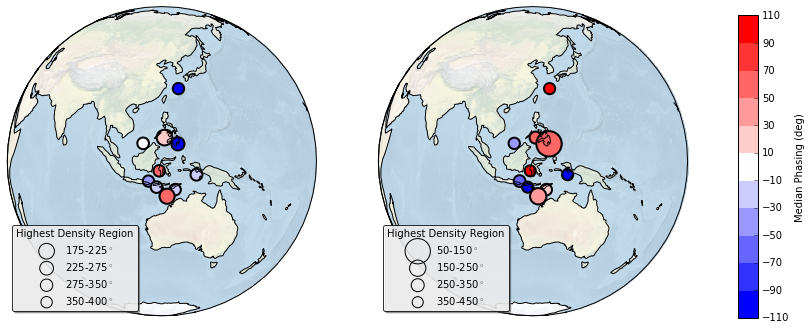

<div class="alert alert-warning" role="alert" style="margin: 10px">
<p><b>NOTE</b></p>
<p>This is Markdown rendition of a <a href ='http://jupyter.org'>Jupyter Notebook</a>.</p>
</div>


# Testing the Millennial-Scale Holocene Solar-Climate Connection in the Indo-Pacific Warm Pool

<p>D. Khider<sup>1</sup>, J. Emile-Geay<sup>1</sup>, N. McKay <sup>2</sup>, C.S. Jackson <sup>3</sup>, C. Rouston <sup>2</sup></p>

<p><sup>1</sup> University of Southern California<br>
<sup>2</sup> Northern Arizona University<br>
<sup>3</sup> The University of Texas at Austin</p>

## Motivation

<p>The existence of 1000 and 2500-year periodicities found in reconstructions of total solar irradiance (TSI) and a number of Holocene climate records has led to the hypothesis of a causal relationship<sup>[1-3]</sup>. However, attributing millennial-scale variability to solar forcing requires a mechanism by which small changes in total solar irradiance can influence a global climate response. One possible amplifier within the climate system is the ocean. If this is the case, then we need to know about where and how this may be occurring. On the other hand, the similarity in spectral peaks could be merely coincidental, and this should be made apparent by a lack of coherence in how that power and phasing are distributed in time and space.</p>

<p style="font-weight: bold"> The plausibility of the solar forcing hypothesis is assessed trough a Bayesian model of the age uncertainties affecting marine sedimentary records that is propagated through spectral analysis of the climate and forcing signals at key frequencies<sup>[4]</sup>.</p>

## Methods

### Data Selection

All the data used in this study are availabled on the <a href="http://wiki.linked.earth"> LinkedEarth wiki </a>, which supports complex queries. The three criteria used here are:
<ol>
    <li> SST-sensitive proxies, including Mg/Ca, U<sub>37</sub><sup>k'</sup>, TEX86 </li>
    <li> >5000 years long </li>
    <li> Radiocarbon-based chronologies </li>
</ol>

<p>The LinkedEarth wiki can be queried using a variety a methods detailed <a href="http://wiki.linked.earth/Querying_the_Datasets#Querying_Linked_Earth_Data_from_another_Program.2FScript"> here </a>. The code below describes a query made in the <a href='https://www.w3.org/TR/rdf-sparql-query/'>SPARQL</a> language.</p>

<div class="alert alert-warning" role="alert" style="margin: 10px">
<p><b>NOTE</b></p>
<p>We are working on GUI-based queries for the wiki.</p>
</div>


```python
%%python
import json
import requests

url = "http://wiki.linked.earth/store/ds/query"

query = """prefix xsd: <http://www.w3.org/2001/XMLSchema#>
#Distinct gives you a single value for the variables you are asking for
SELECT distinct ?dataset
WHERE {

  ?dataset <http://linked.earth/ontology#includesPaleoData> ?d.
  ?d <http://linked.earth/ontology#foundInMeasurementTable> ?t.
  ?t <http://linked.earth/ontology#includesVariable> ?v.
  ?t <http://linked.earth/ontology#includesVariable> ?v1.
  OPTIONAL {?v <http://linked.earth/ontology#measuredOn> ?a.
  ?a a <http://linked.earth/ontology#MarineSediment>.}
  #variable ?v of the dataset should be about either Mg/ca, Uk37 or TEX86
  VALUES ?proxy { "Mg/Ca" "Uk37" "TEX86"}
  ?v <http://linked.earth/ontology#onProxyObservationProperty> ?p.
  ?p <http://www.w3.org/2000/01/rdf-schema#label> ?proxy.

  #Variable ?v1 should be about Age and pass the following filters.
  ?v1 ?pr ?i.
  ?pr <http://www.w3.org/2000/01/rdf-schema#label> "OnInferredVariableProperty".#Trick, this should be URI
  ?i <http://www.w3.org/2000/01/rdf-schema#label> "Age".#Trick, this should be URI
  {
  ?v1 <http://linked.earth/ontology#hasUnits> "yr BP".
  ?v1 ?hasMinValue ?e1.
  ?hasMinValue <http://www.w3.org/2000/01/rdf-schema#label> "HasMinValue".#trick
  ?v1 ?hasMaxValue ?e2.
  ?hasMaxValue <http://www.w3.org/2000/01/rdf-schema#label> "HasMaxValue". #trick

  filter(?e1<5000 && ?e2>7000 && abs(?e2-?e1)>5000).
  }
  UNION
  {
    ?v1 <http://linked.earth/ontology#hasUnits> "kyr BP".
  ?v1 ?hasMinValue ?e1.
  ?hasMinValue <http://www.w3.org/2000/01/rdf-schema#label> "HasMinValue".#trick
  ?v1 ?hasMaxValue ?e2.
  ?hasMaxValue <http://www.w3.org/2000/01/rdf-schema#label> "HasMaxValue". #trick

  filter(?e1<5 && ?e2>7 && abs(?e2-?e1)>5).
  }

  # Now create a filter for the Indo-Pacific warm pool (longitude: 100 to 160E and latitude: 30S to 30N)
  ?dataset <http://linked.earth/ontology#collectedFrom> ?z.
  ?z <http://www.w3.org/2003/01/geo/wgs84_pos#lat> ?lat. # Get the latitude property
  filter(xsd:float(?lat)<30 && xsd:float(?lat)>-30). #filter
  ?z <http://www.w3.org/2003/01/geo/wgs84_pos#long> ?long. # Get the longitude property
  filter(xsd:float(?long)<160 && xsd:float(?long)>100). #filter
}"""

response = requests.post(url, data = {'query': query})
res = json.loads(response.text)

for item in res['results']['bindings']:
    print (item['dataset']['value'])
```

    http://wiki.linked.earth/Special:URIResolver/MD982181.Khider.2014
    http://wiki.linked.earth/Special:URIResolver/A7.Oppo.2005
    http://wiki.linked.earth/Special:URIResolver/MD982176.Stott.2004
    http://wiki.linked.earth/Special:URIResolver/BJ8-2D03-2D13GGC.Linsley.2010
    http://wiki.linked.earth/Special:URIResolver/BJ8-2D03-2D70GGC.Linsley.2010
    http://wiki.linked.earth/Special:URIResolver/MD01-2D2390.Steinke.2008
    http://wiki.linked.earth/Special:URIResolver/MD97-2D2141.Rosentha.2003
    http://wiki.linked.earth/Special:URIResolver/MD98-2D2165.Levi.2007
    http://wiki.linked.earth/Special:URIResolver/MD98-2D2170.Stott.2004
    http://wiki.linked.earth/Special:URIResolver/MD01-2D2378.Xu.2008


<div class="alert alert-warning" role="alert" style="margin: 10px">
<p><b>NOTE</b></p>
<p>We are working on a way to upload the LiPD files directly into the workspace of a Jupyter Notebook</p>
</div>

The locations of the records resulting from the queries are plotted on the map below.


## Age model

The age models for each of the sedimentary records considered in this study were obtained using the Bchron software<sup>[5]</sup>. Jupyter Notebook allows to switch between the Python and R languages easily using <a href='https://ipython.org/ipython-doc/3/interactive/magics.html'>cell magics</a>.


## Spectral Analysis
### Lomb-Scargle Periodogram
Holocene periodicities were inferred from the Lomb-Scargle periodogram<sup>[6]</sup>, which allows to handle unevenly-spaced timeseries, for each of the age model realizations (n=1000) returned by Bchron. We then identified the maximum peak within the 900-1200 year band, the 1200-2000 year band, and the 2000-3000 year band if present. The median periodicity is calculated at the median of the peak periodicities thus identified while the highest density region represents the 95% confidence interval on the peak periodicities.


<div class="alert alert-warning" role="alert" style="margin: 10px">
<p><b>NOTE</b></p>
<p>Standard adoptions also allows to build codes for the community by the community. The LinkedEarth team is currently building Python and R packages for the analysis of paleoclimate data.</p>
<p> For the R version, see <a href='http://nickmckay.github.io/GeoChronR/'>GeochronR</a>.</p>
<p> For the Python version, see <a href='http://pythonhosted.org/pyleoclim/'>Pyleoclim</a>. </p>
</div>

### Cross-Wavelet Analysis
We performed cross-wavelet analysis<sup>[7]</sup> between each realization of the sedimentary records and the TSI record of ref 9. Since the cross-wavelet analysis code was written in the Matlab language, we use pymatbridge to run a m-file within the Python environment.

Python is a "glue" language, allowing codes already written in R and Matlab to be reused.

```python
# Get a Matlab session started
from pymatbridge import Matlab
mlab = Matlab()

mlab = Matlab(executable='/Applications/MATLAB_R2016a.app/bin/matlab')

mlab.start()
```

    Starting MATLAB on ZMQ socket ipc:///tmp/pymatbridge-4ca9fe0f-1eae-49fb-8e9a-2188d8b16241
    Send 'exit' command to kill the server
    ..........MATLAB started and connected!


    //anaconda/lib/python3.5/site-packages/IPython/nbformat.py:13: ShimWarning: The `IPython.nbformat` package has been deprecated. You should import from nbformat instead.
      "You should import from nbformat instead.", ShimWarning)


    <pymatbridge.pymatbridge.Matlab at 0x128c5e898>


## Results
### Holocene Periodicities within the Indo-Pacific Warm Pool
The median periodicity is expressed as the median peak of the ensemble spectra while the highest density region (HDR) represents the 95% confidence interval on the ensemble spectra.
#### 900-1200-yr band


Mean periodicity &#177; standard error = 1022 &#177; 27 years.

#### 1200-2000-yr band


Mean periodicity &#177; standard error = 1486 &#177; 96 years.

#### 2000-3000 yr band


Mean periodicity &#177; standard error = 2391 &#177; 138 years.

<p>Despite large uncertainties in the location of the spectral peak within each individual record arising from age model uncertainty, sea surface variability of ~1000 years, ~1500 years, and ~2500 years are present in at least 70-95% of the ensemble spectra.</p>

<p> Remarkably, all records suggest a periodicity near ~1500 years, reminiscent of the cycles characteristic of Marine Isotope Stage 3<sup>[8]</sup>. These cycles are absent from existing records of TSI<sup>[9]</sup>, questioning the millennial-scale solar-climate connection.

### The role of the sun




<p>The mean phase &#177; standard deviation is -17&#177;55&#176; for the periodicity centered around ~1000 years and 10&#177;97&#176; for the periodicity centered around ~2500 years.</p>

## Future Work
<ol>
<li> <b>Expand the database</b> to global coverage. </li>
<li> <b>Explore lead-lag relationships</b> among various regions. </li>
<li> <b>Estimate magnitude</b> of millennial-scale variability. </li>
</ol>

## LinkedEarth and the future of paleoclimatology
<ul>
<li> <b>Crowdsource data curation</b> though a wiki platform. </li>
<li> <b> Develop web standards</b> for paleoclimate observations. </li>
<li> <b> Develop social codes</b> to accelerate scientific discovery. </li>
</ul>

<p style="font-weight:bold"> The ultimate goal of LinkedEarth is to allow scientists to spend more time on science, less on issues computers can solve. </p>

## Key points
<ol>
<li> The large age model uncertainty inherent to paleoceanographic reconstructions prevents meaningful analysis of periodicities from one single record. </li>
<li> Synthesis of multple records suggests robust periodicities centered around ~1000 years, ~1500 years and ~2500 years in sea surface temperature variability within the Indo-Pacific Warm Pool. </li>
</ol>
<p style="font-weight:bold"> We cannot discard the possibility that the sun might have paced millennial-scale climate variability over the Holocene. </p>
<ol>
<li> Refuting or accepting the solar forcing hypothesis will require additional records with a global coverage.</li>
<li> LinkedEarth aims to facilitate synthesis work to answer pressing questions in paleoclimatology. </li>
</ol>

## References
1.	Bond, G., et al., Persistent solar influence on North Atlantic climate during the Holocene. Science, 2001. 294(2130): p. 2130-2136.
2.	Debret, M., et al., The origin of the 1500-year climate cycles in Holocene North Atlantic record. Climate of the Past Discussions, 2007. 3: p. 679-692.
3.	Debret, M., et al., Evidence from wavelet analysis for a mid-Holocene transition in global climate forcing. Quaternary Science Reviews, 2009. 28(25-26): p. 2675-2688.
4.	Khider, D., C.S. Jackson, and L.D. Stott, Assessing millennial-scale variability during the Holocene: A perspective from the western tropical Pacific. Paleoceanography, 2014. 29(3): p. 143-159.
5.	Haslett, J. and A. Parnell, A simple monotone process with application to radiocarbon-dated depth chronologies. Journal of the Royal Statistical Society C, 2008. 57: p. 399-418.
6.	Lomb, N.R., Least-squares frequency analysis of unequally spaced data. Astrophysics and Space Science, 1976. 39: p. 447-462.
7.	Grinsted, A., J.C. Moore, and S. Jevrejeva, Application of the cross wavelet transform and wavelet coherence to geophysical time series. Nonlinear processes in Geophysics, 2004. 11: p. 561-566.
8.	Schulz, M., On the 1470-year pacing of Dansgaard-Oeschger warm events. Paleoceanography, 2002. 17(2).
9.	Steinhilber, F., et al., 9,400 years of cosmic radiation and solar activity from ice cores and tree rings. Proc Natl Acad Sci U S A, 2012. 109(16): p. 5967-71.

### Acknowledgements
This material is based upon work supported by the National Science Foundation under Grant Number ICER-1541029. Any opinions, findings, and conclusions or recommendations expressed in this material are those of the investigators and do not necessarily reflect the views of the National Science Foundation.
